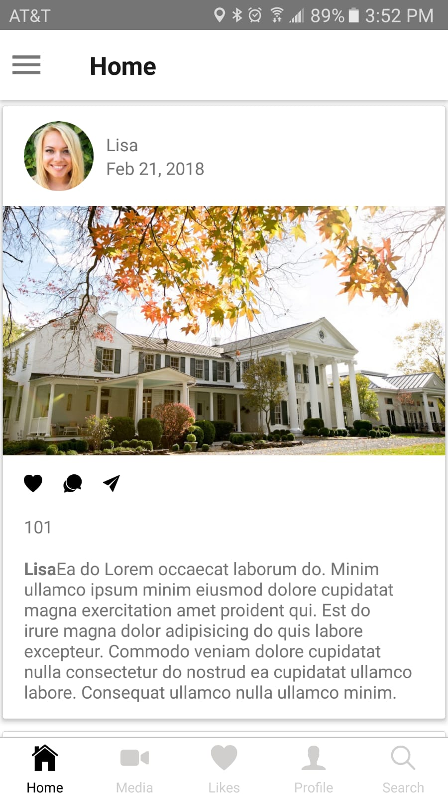

# React Native application template in the development of your next mobile app

As an engineer, many times you faced a basic problem to start a new project. Where to start? What all practices to follow? Can I find some bootstrap project which has zero compliance issue, basic plumbing in place and skeleton code which can be picked to build your product foundation?

This sample powerful starter project bootstraps development of your mobile application and saves your time so that you can directly focus on your business specific development instead of spending time with the initial setup and building blocks.

# What is in this project?

1. Login screen
2. Welcome screen
3. Active Directory Authentication
4. Navigation context
5. Redux implementation
6. Navigation menu drawer
7. Tab navigation

### Home screen 



## Get started

Start by downloading the project:

```console
npm i
```

## Setup

**Note 1:** Make sure to replace [CLIENT ID] and [REDIRECT URI] with the actual values for your application configuration.
